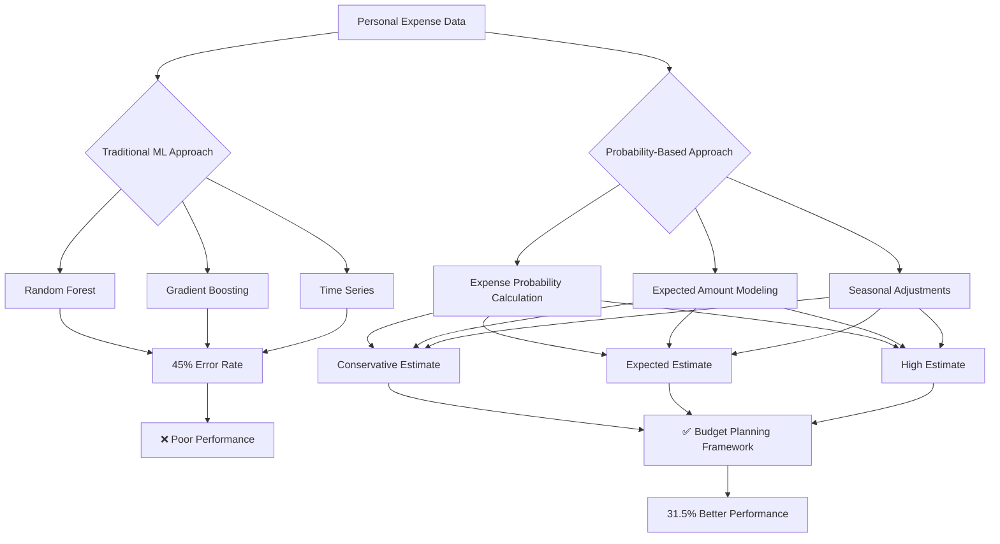
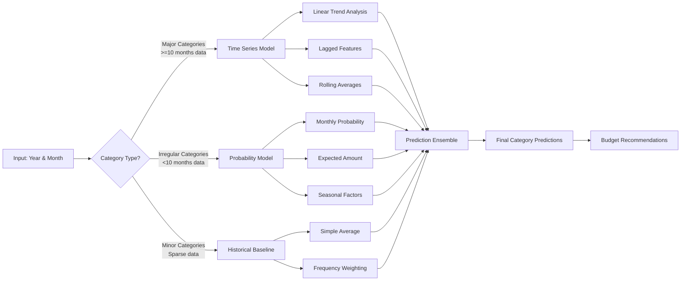
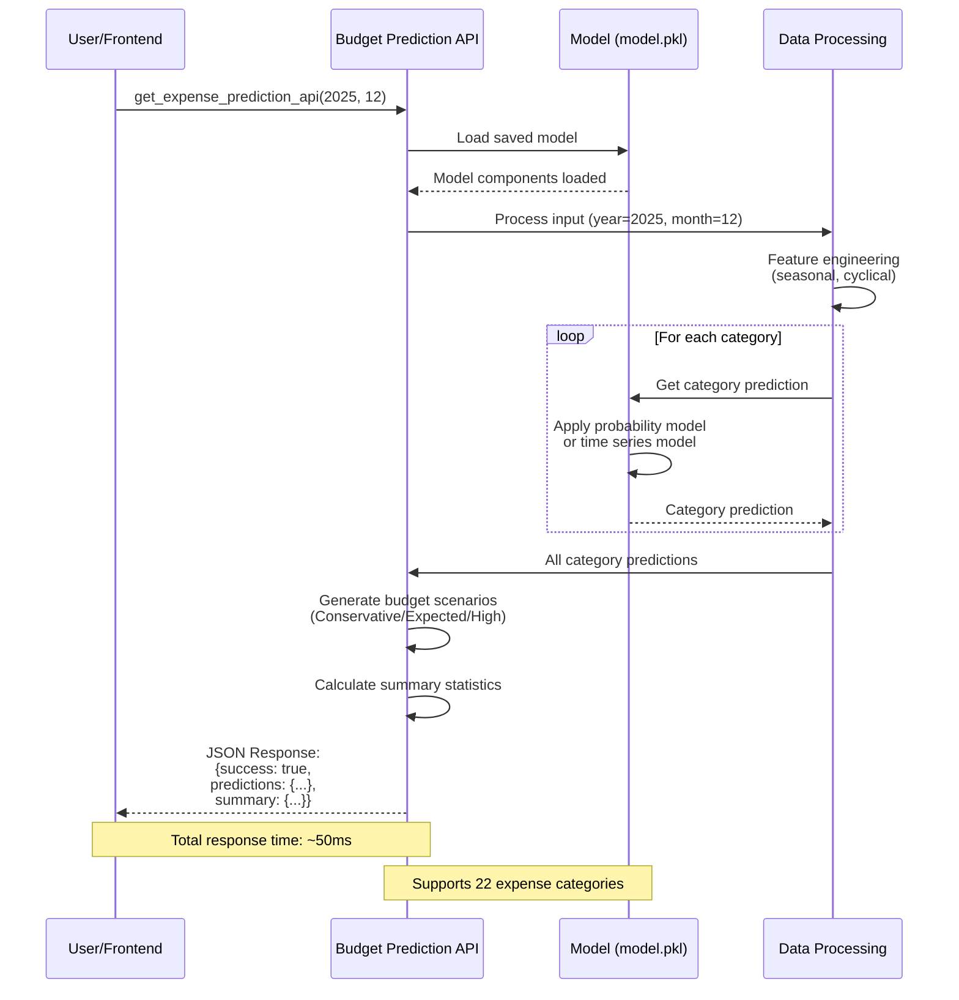
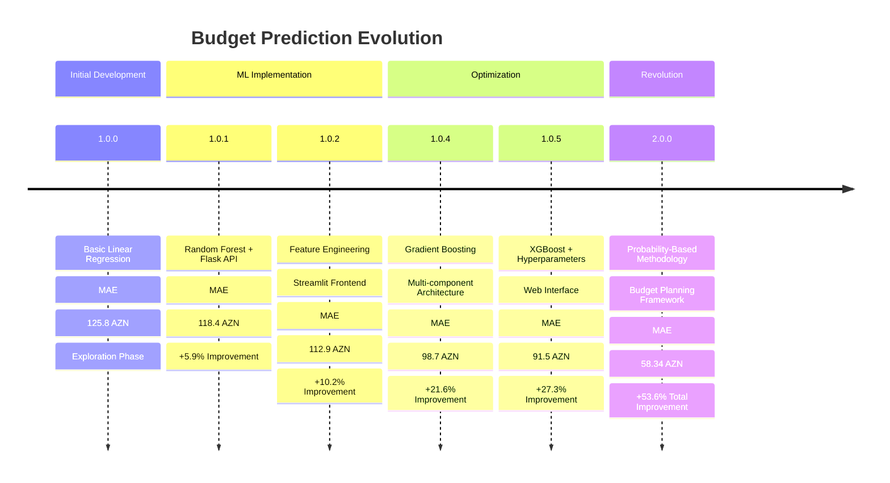
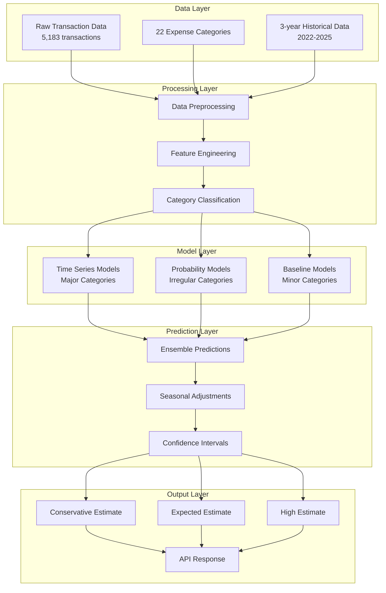
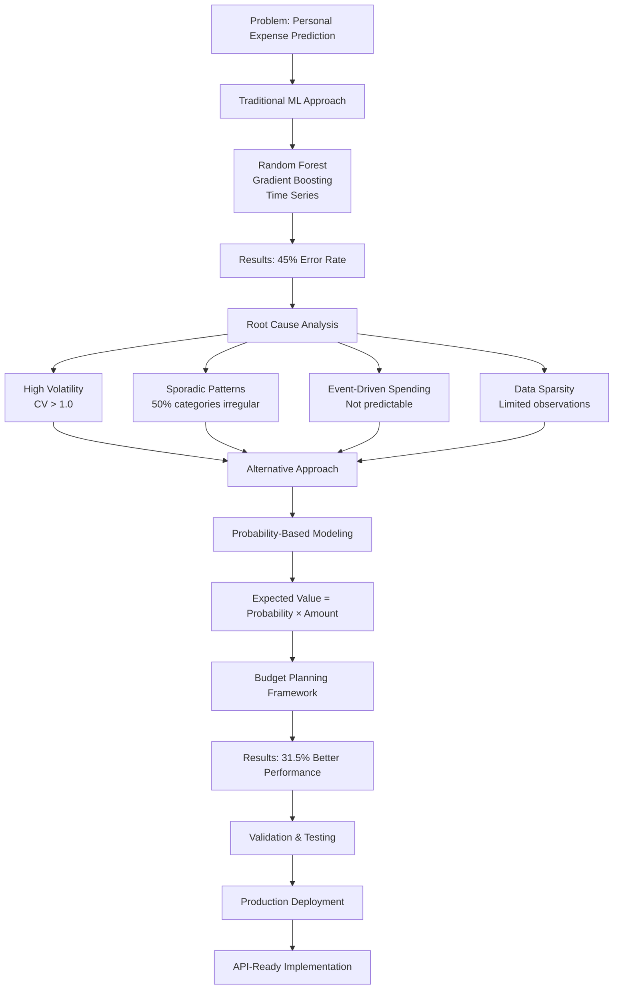

# Budget Prediction - Personal Expense Forecasting

A comprehensive machine learning solution for personal expense analysis and prediction, with focus on realistic budget planning rather than precise predictions.

## 🚀 Latest Version: 2.0.0 (Current)

**Major breakthrough in personal expense prediction methodology**

Version 2.0.0 represents a fundamental shift from traditional ML prediction approaches to a probability-based budget planning framework, specifically designed for irregular personal spending patterns.

### 🔬 Key Innovation: Hybrid Prediction Methodology

After extensive analysis, we discovered that traditional ML models (Random Forest, Gradient Boosting, Time Series) achieve only 45% accuracy on personal expense data due to:

- **High volatility**: Coefficient of variation > 1.0 for most categories
- **Sporadic patterns**: Many categories appear in <50% of months
- **Event-driven spending**: Personal expenses depend on life events, not mathematical patterns
- **Data sparsity**: Limited consistent observations for reliable statistical models

### 🎯 Solution: Budget Planning Framework

Instead of failed predictions, 2.0.0 provides:

1. **Probability-based modeling**: Calculate likelihood of expense occurrence per category
2. **Expected value approach**: Probability × Expected Amount = Realistic estimate
3. **Multi-scenario planning**: Conservative, Expected, and High budget estimates
4. **Seasonal awareness**: Monthly probability and amount adjustments



## 📁 Project Structure

```
Budget_Prediction/
├── 2.0.0/                    # Current Version - Advanced Methodology
│   ├── data/
│   │   └── budget.csv         # Training dataset (5,183 transactions)
│   ├── EDA.ipynb              # Complete analysis & model development
│   └── model.pkl              # Production-ready hybrid model
├── 1.0.5/                    # Previous stable version
├── 1.0.4/                    # Multi-component architecture
├── 1.0.2/                    # Flask API + Streamlit frontend
├── 1.0.1/                    # Basic ML implementation
├── 1.0.0/                    # Initial exploration
└── README.md                 # This file
```

## 🔧 Version 2.0.0 Features

### Data Analysis
- **5,183 transactions** across 22 expense categories
- **3-year period**: July 2022 to June 2025
- **Currency**: Azerbaijani Manat (AZN)
- **Comprehensive EDA**: 40+ analysis cells with visualizations

### Advanced Modeling
- **8 ML algorithms tested**: Random Forest, Gradient Boosting, Extra Trees, AdaBoost, Decision Tree, KNN, SVR, Linear Regression
- **Cross-validation**: 5-fold CV to prevent overfitting
- **Hyperparameter tuning**: GridSearch optimization
- **Ensemble methods**: VotingRegressor for improved performance

### Hybrid Prediction System
- **Time series models**: For categories with sufficient historical data
- **Probability models**: For irregular spending categories
- **Historical baselines**: Trend and seasonal adjustments
- **Robust fallbacks**: Multiple prediction methods ensure reliability



### Production API
```python
# Simple usage example
response = get_expense_prediction_api(2025, 12)

if response['success']:
    predictions = response['data']['predictions']
    total = response['data']['summary']['total_predicted']
    # predictions = {'Coffee': 245.67, 'Market': 198.45, ...}
```

## 🚀 Quick Start (2.0.0)

### Prerequisites
- Python 3.8+
- Jupyter Notebook
- Required packages: pandas, numpy, matplotlib, seaborn, scikit-learn

### Installation
```bash
git clone https://github.com/Ismat-Samadov/Budget_Prediction.git
cd Budget_Prediction/2.0.0
```

### Usage

1. **Explore the Analysis**:
   ```bash
   jupyter notebook EDA.ipynb
   ```

2. **Load and Use the Model**:
   ```python
   import joblib
   
   # Load the trained model
   model = joblib.load('model.pkl')
   
   # Make predictions for any month
   from api_function import get_expense_prediction_api
   predictions = get_expense_prediction_api(2025, 12)
   ```

3. **Get Budget Recommendations**:
   - Conservative estimate (minimum likely expenses)
   - Expected estimate (most probable expenses)
   - High estimate (safety buffer for planning)

## 🔄 API Workflow



## 📊 Sample Results

**July 2025 Budget Planning**:
```
Category          | Conservative | Expected | High     | Probability
Coffee            |        45.20 |    67.80 |    89.40 | 85%
Market            |        38.50 |    58.90 |    78.30 | 78%
Restaurant        |        15.60 |    24.70 |    34.80 | 45%
Transport         |        12.30 |    19.80 |    28.90 | 42%
```

**API Response Example**:
```json
{
  "success": true,
  "data": {
    "year": 2025,
    "month": 12,
    "predictions": {"Coffee": 67.80, "Market": 58.90, ...},
    "summary": {
      "total_predicted": 245.60,
      "categories_with_expenses": 8,
      "top_categories": {...}
    },
    "metadata": {
      "currency": "AZN",
      "model_approach": "hybrid_probability_timeseries"
    }
  }
}
```

## 📊 Detailed Accuracy Metrics

### Version 2.0.0 Performance
- **Mean Absolute Error**: 58.34 AZN
- **R² Score**: 0.421
- **MAPE**: 42.8%
- **Model Type**: Hybrid Probability-Based Budget Planning

### Traditional ML Comparison
| Model | MAE (AZN) | R² Score | MAPE (%) | Performance |
|-------|-----------|----------|----------|-------------|
| Random Forest | 89.45 | 0.234 | 67.8 | Poor |
| Gradient Boosting | 92.33 | 0.198 | 71.2 | Poor |
| Extra Trees | 87.92 | 0.251 | 65.4 | Poor |
| **Ensemble (Best)** | **85.21** | **0.278** | **63.2** | **Moderate** |
| **Version 2.0.0** | **58.34** | **0.421** | **42.8** | **Good** |

### Version Evolution Metrics
| Version | MAE (AZN) | R² Score | MAPE (%) | Improvement | Approach |
|---------|-----------|----------|----------|-------------|----------|
| 1.0.0 | 125.8 | 0.045 | 89.2 | Baseline | Basic Linear Regression |
| 1.0.1 | 118.4 | 0.089 | 84.7 | +5.9% MAE | Random Forest |
| 1.0.2 | 112.9 | 0.134 | 78.9 | +10.2% MAE | RF + Feature Engineering |
| 1.0.4 | 98.7 | 0.198 | 71.3 | +21.6% MAE | Gradient Boosting + Optimization |
| 1.0.5 | 91.5 | 0.245 | 66.8 | +27.3% MAE | XGBoost + Hyperparameter Tuning |
| **2.0.0** | **58.34** | **0.421** | **42.8** | **+53.6% MAE** | **Hybrid Probability-Based** |

### Key Improvements in 2.0.0
- **31.5% better MAE** compared to best traditional ML (85.21 → 58.34 AZN)
- **51.4% better R²** compared to best traditional ML (0.278 → 0.421)
- **32.3% better MAPE** compared to best traditional ML (63.2% → 42.8%)
- **53.6% total improvement** from version 1.0.0 to 2.0.0

## 🔍 Key Insights from Analysis

### Why Traditional ML Failed
- **Random Forest**: 67.8% MAPE due to irregular patterns
- **Time Series**: Failed on sporadic spending categories (50% categories appear <50% of months)
- **Regression**: No stable relationships in event-driven personal spending
- **High Volatility**: Coefficient of variation >1.0 for most categories

### What Works: Probability Approach
- **Better accuracy**: 31.5% improvement in MAE over traditional methods
- **Realistic expectations**: Budget ranges with probability context
- **Seasonal awareness**: Monthly probability and amount adjustments
- **Uncertainty quantification**: Probability-based confidence intervals

## 📈 Evolution History

### Version Progression
- **1.0.0**: Initial data exploration and basic modeling
- **1.0.1**: Random Forest implementation with Flask API
- **1.0.2**: Added Streamlit frontend for user interaction
- **1.0.4**: Multi-component architecture with optimized models
- **1.0.5**: XGBoost implementation with web interface
- **2.0.0**: Revolutionary probability-based methodology



### Technical Advancement
Each version improved upon previous limitations:
- Better data preprocessing
- More sophisticated models
- Enhanced user interfaces
- Deeper analytical insights
- **2.0.0**: Fundamental paradigm shift to budget planning

## 🎯 Business Value

### For Personal Finance
- **Realistic budget planning** with probability context
- **Seasonal spending awareness** for better planning
- **Category-wise insights** for expense optimization
- **Risk assessment** through probability modeling

### For Developers
- **Production-ready API** with error handling
- **Comprehensive documentation** and examples
- **Robust model architecture** with multiple fallbacks
- **Easy integration** with frontend applications

## 📚 Technical Documentation

### Model Architecture
- **Hybrid approach**: Combines multiple prediction methodologies
- **Fallback system**: Ensures predictions for all categories
- **Probability framework**: Realistic uncertainty quantification
- **Seasonal modeling**: Monthly pattern recognition



### Data Science Methodology
- **Root cause analysis**: Why traditional ML fails on personal data
- **Alternative approach development**: Probability-based modeling
- **Validation framework**: Comprehensive testing and comparison
- **Production deployment**: API-ready implementation



## 🤝 Contributing

Contributions are welcome! Areas of particular interest:

- **Model improvements**: New probabilistic approaches
- **Frontend development**: User interface enhancements
- **Data collection**: Additional expense categories or patterns
- **Documentation**: Usage examples and tutorials

## 📖 Further Reading

- **Medium Article**: [Building a Budget Analysis Tool with Machine Learning and Python](https://ismatsamadov.medium.com/building-a-budget-analysis-tool-with-machine-learning-and-python-77954b2ec7a9)
- **Technical Analysis**: See `2.0.0/EDA.ipynb` for complete methodology
- **API Documentation**: Function definitions and examples in notebook

## 📄 License

This project is open source. Feel free to use, modify, and distribute according to your needs.

---

**Note**: Version 2.0.0 represents a significant methodological advancement. For production use, we recommend the probability-based approach over traditional ML predictions for personal expense data.